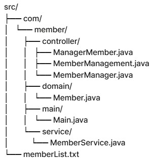

## 회원관리 프로그램

### 1. Main.java
프로그램의 진입점으로, 관리자 인증 후 사용자에게 메뉴를 제공하여 다양한 회원 관리 작업을 수행합니다.

### 2. ManagerMember.java
관리자 인증을 처리하는 클래스입니다. 관리자의 ID와 비밀번호를 확인하고, 3회 인증 실패 시 프로그램을 종료합니다.

### 3. Member.java
회원 정보를 저장하는 도메인 클래스입니다. 회원 번호, 이름, 전화번호, 주소 및 비밀번호를 포함합니다.

### 4. MemberManagement.java
회원 관리 인터페이스로, 회원 생성, 조회, 수정, 삭제 및 목록 출력을 위한 메서드를 정의합니다.

### 5. MemberManager.java
회원 관리 기능을 구현하는 클래스입니다. 회원 정보를 저장하고, 파일에서 읽고 쓸 수 있는 기능을 제공합니다.

### 6. MemberService.java
회원 관리 서비스를 제공하는 클래스입니다. 사용자 입력을 처리하고, 회원 등록, 조회, 수정, 삭제 및 목록 출력 기능을 담당합니다.



## 사용 방법
1. **환경 설정**: Java JDK가 설치되어 있어야 합니다.
2. **소스 코드 컴파일**: `src` 디렉토리에서 Java 파일을 컴파일합니다.
   ```bash
   javac com/member/main/Main.java

