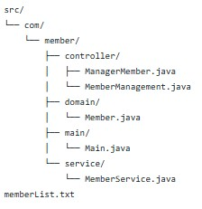

# 회원 관리 프로그램

## 개요
이 프로젝트는 관리자 인증을 통해 회원 정보를 등록, 조회, 수정 및 삭제할 수 있는 회원 관리 프로그램입니다. Java를 사용하여 구현되었으며, 사용자 친화적인 메뉴 기반 인터페이스를 제공합니다.

## 기능
- **회원 관리**: 회원 추가, 수정, 삭제 및 조회 기능을 제공
- **도메인 모델**: 회원 정보를 관리하기 위한 데이터 구조
- **서비스 로직**: 회원 관련 비즈니스 로직을 처리
- **진입점**: 프로그램 실행을 위한 메인 클래스

1. 고객 정보 등록
2. 고객 정보 조회
3. 고객 정보 수정
4. 고객 정보 삭제
5. 고객 정보 목록 출력
6. 고객 정보 파일 출력
7. 관리자 인증

## 파일 구조


## 소스 디렉토리 (src/)
- **com/**: 기본 패키지
  - **member/**: 회원 관련 기능
    - **controller/**: 회원 관리 로직
      - `ManagerMember.java`: 회원 관리 매니저
      - `MemberManagement.java`: 회원 관리 기능 구현
      - `MemberManager.java`: 회원 관련 기능 처리
    - **domain/**: 도메인 모델
      - `Member.java`: 회원 정보 모델 클래스
    - **main/**: 프로그램의 진입점
      - `Main.java`: 프로그램 실행을 위한 메인 클래스
    - **service/**: 비즈니스 로직
      - `MemberService.java`: 회원 관련 서비스 로직
- `memberList.txt`: 회원 목록 데이터 파일


## 클래스 설명

### 1. Main.java
프로그램의 진입점으로, 관리자 인증 후 사용자에게 메뉴를 제공하여 다양한 회원 관리 작업을 수행합니다.

### 2. ManagerMember.java
관리자 인증을 처리하는 클래스입니다. 관리자의 ID와 비밀번호를 확인하고, 3회 인증 실패 시 프로그램을 종료합니다.

### 3. Member.java
회원 정보를 저장하는 도메인 클래스입니다. 회원 번호, 이름, 전화번호, 주소 및 비밀번호를 포함합니다.

### 4. MemberManagement.java
회원 관리 인터페이스로, 회원 생성, 조회, 수정, 삭제 및 목록 출력을 위한 메서드를 정의합니다.

### 5. MemberManager.java
회원 관리 기능을 구현하는 클래스입니다. 회원 정보를 저장하고, 파일에서 읽고 쓸 수 있는 기능을 제공합니다.

### 6. MemberService.java
회원 관리 서비스를 제공하는 클래스입니다. 사용자 입력을 처리하고, 회원 등록, 조회, 수정, 삭제 및 목록 출력 기능을 담당합니다.

## 사용 방법
1. **환경 설정**: Java JDK가 설치되어 있어야 합니다.
2. **소스 코드 컴파일**: `src` 디렉토리에서 Java 파일을 컴파일합니다.
   ```bash
   javac com/member/main/Main.java

